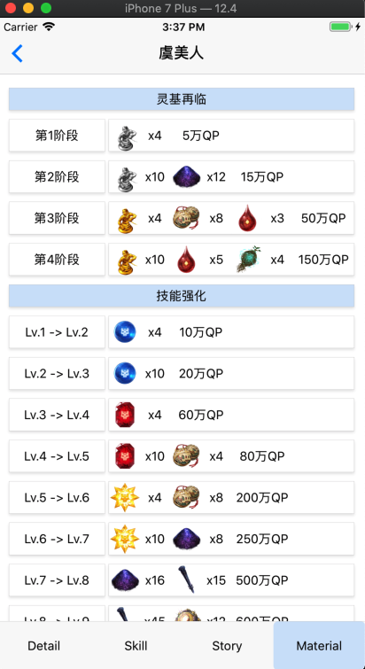
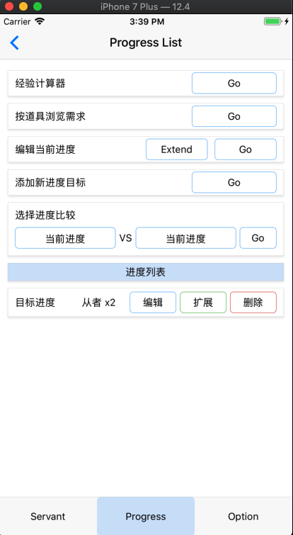
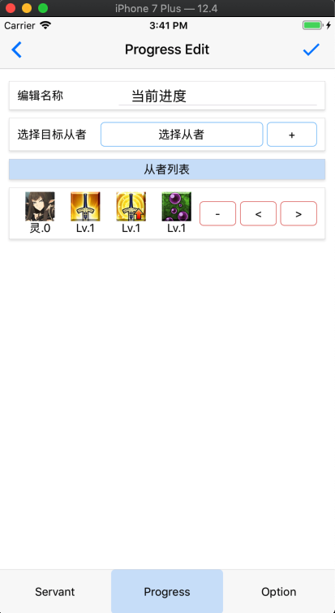
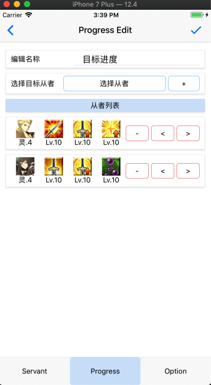
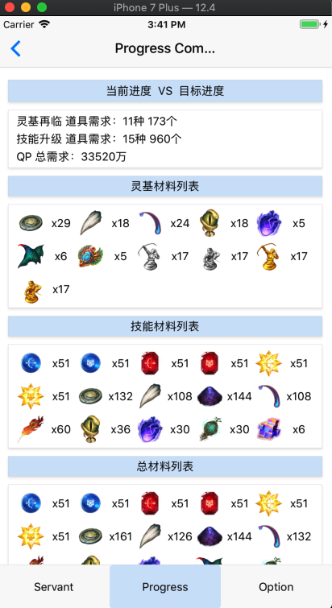
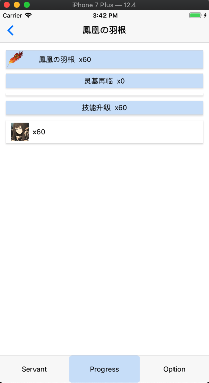
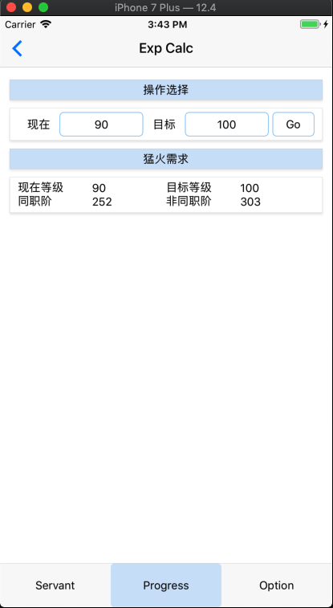
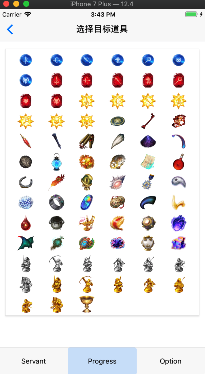
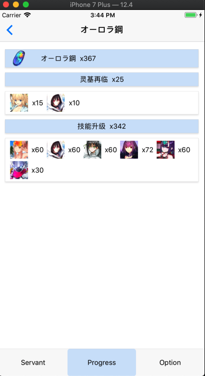

Fgo Handbook
============

## 1. 简介

React Native 实验项目。

主要功能：

* 列出当前所有的从者，含：从者基本信息、从者技能、从者故事、从者材料需求
* 种火经验计算器
* 根据材料查看该材料所有的数量需求
* 编辑当前玩家的从者等级等进度信息
* 制作玩家的目标进度信息
* 进行当前进度和目标之间的比对，获得需要的材料和QP数量

主界面 从者列表：


从者列表过滤器：


从者主界面：


从者材料消耗界面：



进度功能主界面：



当前进度编辑界面：



目标进度编辑界面：



进度比对结果界面：



进度比对结果中某种材料具体消费细节界面：



经验计算器：



材料使用界面：



具体材料使用细节界面：



## 2. Note

代码主要分为两部分：

* src/mobile：这部分是RN相关的移动应用代码
* src/server：这部分是Node.JS的命令行下更新脚本

对应有两份tsconfig配置文件：

* 对应mobile的是根目录下的tsconfig.json
* 对应server的是根目录下的server-tsconfig.json

tsc生成的代码在：

* mobile：build
* server：server_build

## 3. 更新

当有版本需要更新的时候，需要：

* 运行`gulp watch`，编译出对应的mobile和server可执行的js代码
* 运行`node server_build/server/Runner.js`，从网络获取版本信息
* 获取的最新版本信息和图片等，会放在`database/x.x.x`下
* 并且会同步将最新的一份版本内容放到`src/resource`下，便于后面进行bundle

然后需要改动`ios/mobile/AppDelegate.m`文件，把`jsCodeLocation`这行的内容替换成`jsbundle`代码

接下来运行`bash/bundle.ios.sh`，制作出静态jsbundle，放在`ios/bundle`下

最后使用xcode，将项目编译并部署到真机上

### 3.1 当更新发生问题的时候

需要修改`src/server/Runner.ts`，把`manuallyUpdateVer`从`undefined`修改成`x.x.x`版本号，一般是最新一次更新生成的版本号，然后在运行Runner.js

这个操作会避免再运行一系列的图片下载行为，对脚本资源的下载和分析有加速作用

## 4. Tips
当前使用的RN版本是有致命BUG的，但我也不想更换了，每次一换都是一堆问题。

在npm安装完成之后记得：
```
mkdir node_modules/react-native/packager
cp node_modules/react-native/scripts/react-native-xcode.sh node_modules/react-native/packager/react-native-xcode.sh
```

自从某次更新版本之后发现了这个问题我就对RN完全失去了兴趣，连最基本的测试都没有做好就放出来的release，对得起FB大厂的脸面？

**UPDATE 2019-08-05**    
因Xcode版本更新的原因，又有部分问题，这里记录下。Clone及安装步骤：

将代码库clone下来    
将本地node版本切换到`v6.10.3`，比较新的node版本会导致npm包安装失败，因为很多老版本的包在新的node版本中不支持    
`npm install .`    
`npm install -g react-native-cli@2.0.1`    

```bash
$ react-native --version
react-native-cli: 2.0.1
react-native: 0.47.1
```

安装完成后

```
mkdir node_modules/react-native/packager
cp node_modules/react-native/scripts/react-native-xcode.sh node_modules/react-native/packager/react-native-xcode.sh
```

然后在xcode中运行一次，会失败，接下来

```
cd ./node_modules/react-native/third-party/glog-0.3.4 && ../../scripts/ios-configure-glog.sh
```

再运行，还会报错，然后

```
cd ./node_modules/react-native/scripts ; ./ios-install-third-party.sh ; cd ../../../
cd ./node_modules/react-native/third-party/glog-0.3.4 && ../../scripts/ios-configure-glog.sh
```

到这里就应该OK了，在xcode中编译运行应该就可以通过了，但记得还要运行`gulp watch; ./bash/bundle.ios.sh`，程序才能真正在模拟器中跑起来